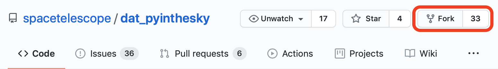

############
GitHub Setup
############

.. _dat_pyinthesky: https://github.com/spacetelescope/dat_pyinthesky

GitHub Accounts
***************

GitHub, is provider of internet hosting for software development and version control using Git.
It offers the distributed version control and source code management functionality of Git, plus its own features.
If you don't have a GitHub account, please visit GitHub's `sign up page <https://github.com/join>`_.

Repository Setup
****************

**Step 1: Fork the STScI Repository**

The first step is to create a GitHub copy of the STScI `dat_pyinthesky`_ repository.
The copied repository on your GitHub account is called a "fork". To make a fork, click on the **``fork``** button at the
upper right corner of the STScI's `dat_pyinthesky`_ repository. A dialog should popup up and you can select your GitHub
account to create the fork.

**Step 2: Clone the Repositories**

After you create a fork of the STScI repository, you should now have a copy of the STScI repository under your GitHub account.
The next step is to make a copy of both your and STScI's GitHub repositories on your local machine. That way you can make
edits on your computer and send the changes to your online repository (fork). The process of making a local copy is called
**cloning**. To clone the `dat_pyinthesky` repos, open up a terminal window and ``cd`` into a directory you would like
to save your local copy. Then run the following bash commands:

.. code:: bash

    # clone the repository
    git clone https://github.com/spacetelescope/dat_pyinthesky

    # cd into the local repository (clone)
    cd dat_pyinthesky

    # rename the online version of the repo
    # from "origin" to "stsci" (since you cloned STScI's version)
    git remote rename origin stsci

Next, you want to link your online GitHub version of the repository (fork) to your local version. Copy the URL to your
fork and run the following command in the terminal
(make sure you are still in the `dat_pyinthesky` folder in the terminal):

.. code:: bash

    # add your GitHub copy
    git remote add <your_github_username> <your_fork_url>

.. warning::

    Make sure not to confuse your fork's URL with the official STScI URL. Your fork's URL will have the following format:

    .. code::

        https://github.com/<your_github_username>/dat_pyinthesky

**Step 3: Check Remote URLs**

At this point, you have finished setting up your local clone of the repository. To check if the setup was successful,
run the following command to list URLs:

.. code:: bash

    # list remote URLs
    git remote -v

This should return:

.. code:: bash

    <your_github_username>  https://github.com/<your_github_username>/dat_pyinthesky.git (fetch)
    <your_github_username>  https://github.com/<your_github_username>/dat_pyinthesky.git (push)
    stsci   https://github.com/spacetelescope/dat_pyinthesky.git (fetch)
    stsci   https://github.com/spacetelescope/dat_pyinthesky.git (fetch)

**Step 4: Create a New Branch**

Next, create a new branch and name it. You can name your new branch anything relevant to your notebook.
Its best to use a short name since you wll need to type it in the terminal often. Do this by running:

.. code:: bash

    git checkout -b <branch_name>

This will automatically change the current branch to the new branch;
it will stay on this branch until you manually change it or create a new one.

.. tip::

    To change to an already existing branch, run ``git checkout <branch_name>``

**Step 5: Synchronize New Branch to STScI**

You should update the branch to make sure its in sync with the STScI `master` branch. To do this, run:

.. code:: bash

    # Fetch changes
    git fetch stsci master

    # Pull (download) changes
    git pull stsci master